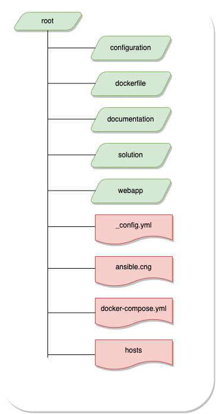

Ansible is a tool used for IT automation with follwoing areas of focus. 

- Software provisioning 
- Application deployment 
- configuration management 
- Infrastruture orechstration

In this workshop we would like to introduce you to at least two aspects mentioned in the list above, thorugh assignments. 


## Assignment goals 
---
We want to introduce you to <b>Software provisioning</b> and <b>Application deployment</b> via a simple example of flask web appplication deployment. We have created four assingments for you to go through and get experince in the ansible works.


### Software provisioning 

For us to deploy a flask web app on to a machine, the machine needs to have flask installed on it. To install flask we need pip installer. 

We have dedicaed two assignments on how to provision these pre-requisits.

### Application deployment

In the next two assingments we want to learn, how to actually deploy the flask web app and start running the app. 


## Architecture 
---
 
To create this workshop, we have used two docker containers . 

- 1st container will have ansible installed on it. We will run all our assignments on this container 
- 2nd container is the target host. This is were the web application will be deployed. 

Docoker compose is used to configure these two containers and build them. 


## Folder structure 
---
Files are organized in the following struture in the workshop 



### configuration 
 
In this folder we have all the assignment files. 

The main playbook is at the top level and is named as playbook.yml. A folder is created for each of the assignment with a subfolder named as tasks. In the tasks folder one can find main.yml file associates with respective task. 

For e.g. 

For <b>Assignment 1 </b> you need modify main.yml file in  folder installpip3/tasks/

These paths are also mentioned in the playbook.yml file. 

### dockerfiles

In this folder we have docker files which would be used by docker compose to build our docker container.

### documentation 

We try to keep all our documentation related to the workshop in this folder. Including the presentations. 

### solutions 

We have placed solution to assingment in this folder 

### webapp 

This folder conatins the flask app that will be used to deploy on the docker host

###  other files 

Rest of the top level files are used of configuring this page (_config.yml), ansible configuration (ansible.cfg), docker compose config(docker-compose.yml) and list all the hosts (hosts)


## Getting started 
---

### Start Docker
To start with make sure docker service is running!

#### Clone repository
Only once, you clone the repository using the command:
```
git clone https://github.com/sebivenlo/ESDE-2022-Ansible-workshop.git
```
##### Change directory into the folder in which you cloned the repository!

#### Start docker service containers
Only once, you start the docker services using the command:
```
docker-compose up --build -d
```

**Be aware that this process can take a while!**

#### Access ansible environment 
Only once, you access the ansible docker container by using the command:
```
docker-compose run ansible
```

#### Change directory
Only once, you change directory by using the command:
```
cd ansible/configuration
```
### Execute ansible-playbook command
Every single time you are ready to test your assigment you run the command:
```
ansible-playbook playbook.yml --extra-vars "ansible_sudo_pass=workshop"
```
#### Solve assignments
whenever your working on an assignment in a file named "main.yml". Start by main file called "playbook.yml". from there you will be directed to the assignments. Every assignment has a goal, task and a link to the documentation. 
solution are easy to find in the documentation. 
 

How we would advice you to work is to first start off with looking at the playbook.yml file in your favourite text editor (Visual Studio Code or for instance Notepad ++). Afterwards, you can choose the assignment to start with by going to the mentioned file. Once you made the assignments you can test it by running the command in the next section


#### Validate output
Each assignement file mentions how the results can be vaildated 