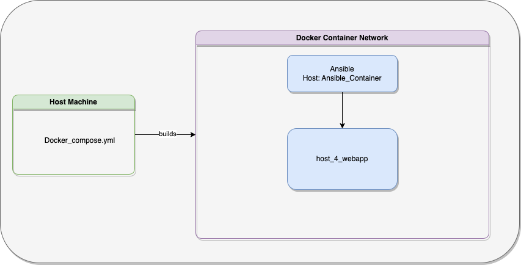

Ansible is a tool used for IT automation with follwoing areas of focus. 

- Software provisioning 
- Application deployment 
- configuration management 
- Infrastruture orechstration

In this workshop we would like to introduce you to at least two aspects mentioned in the list above, thorugh assignments. 

## Assignment goals 
---
We want to introduce you to <b>Software provisioning</b> and <b>Application deployment</b> via a simple example of flask web appplication deployment. We have created four assingments for you to go through and get experince in the ansible works.

### Software provisioning 

For us to deploy a flask web app on to a machine, the machine needs to have flask installed on it. To install flask we need pip installer. 

We have dedicaed two assignments on how to provision these pre-requisits.

### Application deployment

In the next two assingments we want to learn, how to actually deploy the flask web app and start running the app. 

## Architecture 
---
 
To create this workshop, we have used two docker containers . 

- 1st container will have ansible installed on it. We will run all our assignments on this container 
- 2nd container is the target host. This is were the web application will be deployed. 

Docoker compose is used to configure these two containers and build them. 

## File structure 
---

## Getting started 
---